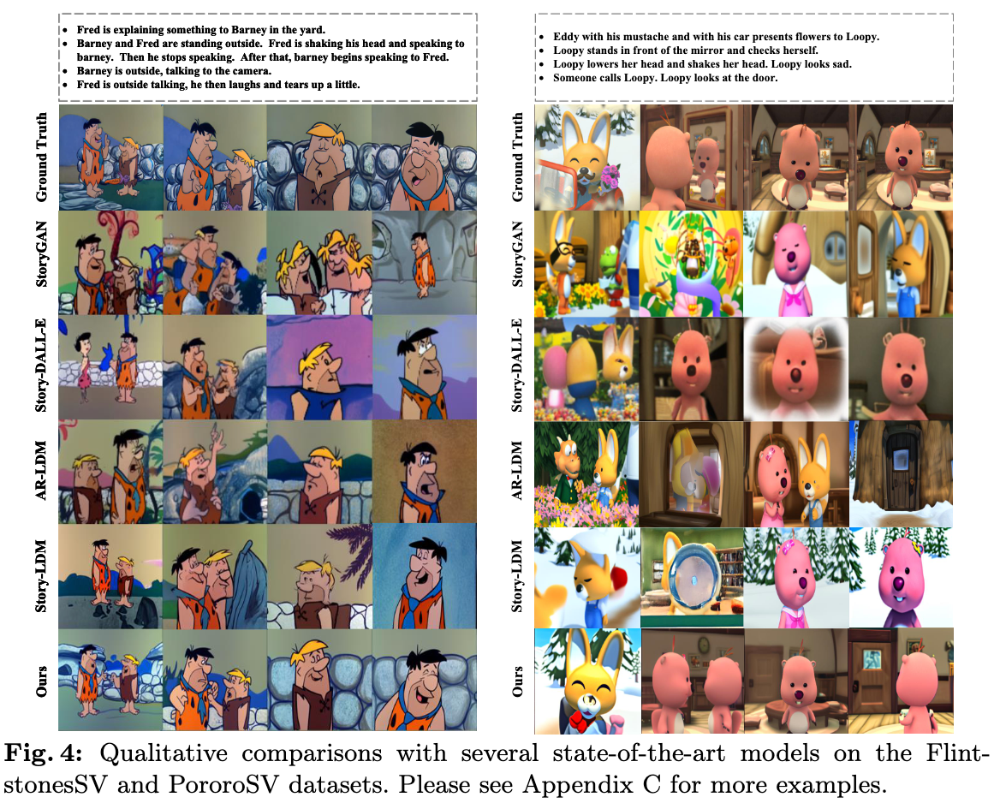
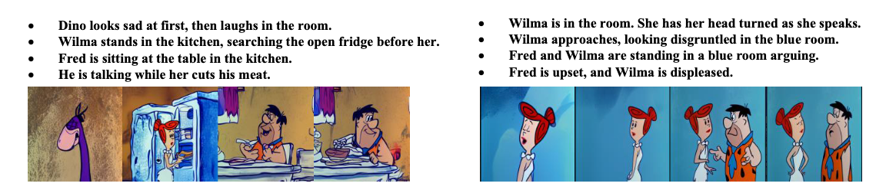
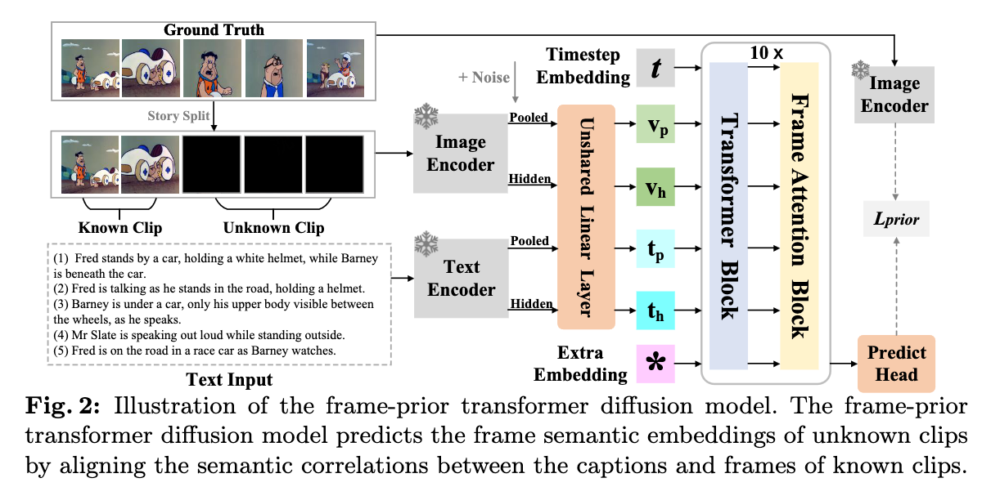
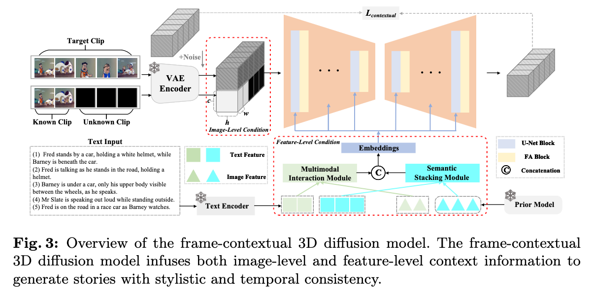

# **Boosting Consistency in Story Visualization with Rich-Contextual Conditional Diffusion Models**


- [2024/12/10]  🔥 RCDMs is accepted by AAAI 2025.
- [2024/08/08]  🔥 We release the train and test code of RCDMs.
- [2024/07/02]  🔥 We release the [paper](https://arxiv.org/pdf/2407.02482) of RCDMs for story generation.

---


### 🚀 **Abstract:**
Recent research showcases the considerable potential of conditional diffusion models for generating consistent stories. However, current methods, which predominantly generate stories in an autoregressive and excessively caption-dependent manner, often underrate the contextual consistency and relevance of frames during sequential generation. To address this, we propose a novel Rich-contextual Conditional Diffusion Models (RCDMs), a two-stage approach designed to enhance story generation’s semantic consistency and temporal consistency. Specifically, in the first stage, the frame-prior transformer diffusion model is presented to predict the frame semantic embedding of the unknown clip by aligning the semantic correlations between the captions and frames of the known clip. The second stage establishes a robust model with rich contextual conditions, including reference images of the known clip, the predicted frame semantic embedding of the unknown clip, and text embeddings of all captions. By jointly injecting these rich contextual conditions at the image and feature levels, RCDMs can generate semantic and temporal consistency stories. Moreover, RCDMs can generate consistent stories with a single forward inference compared to autoregressive models. Our qualitative and quantitative results demonstrate that our proposed RCDMs outperform in challenging scenarios.

## 🔥 **Examples**




## 🏷️  Introduction

Story visualization aims to depict a continuous narrative through multiple captions and reference clips. It has profound applications in game development and comic drawing. Due to the technological leaps in generative models, text-to-image synthesis methods can now generate visually faithful images through text descriptions. However, generating a continuous story with style and temporal consistency still poses significant challenges. Our proposed Rich-contextual Conditional Diffusion Models (RCDMs) tackle these issues by introducing a two-stage diffusion model framework that incorporates rich contextual information at both the image and feature levels.





## Dataset Prepare
Dataset preparation follows the workflow outlined in [ARLDM](https://github.com/xichenpan/ARLDM).


## 🔧 Requirements

- Python >= 3.8 (Recommend to use [Anaconda](https://www.anaconda.com/download/#linux) or [Miniconda](https://docs.conda.io/en/latest/miniconda.html))
- [PyTorch >= 2.0.0](https://pytorch.org/)
- cuda==11.8

```bash
conda create --name rcdms python=3.8.10
conda activate rcdms
pip install -U pip

# Install requirements
pip install -r requirements.txt
```


## 🎉 How to Use


### 1. How to train 

```sh
# stage1
sh run_stage1_PororoSV.sh  or sh run_stage1_FlintstonesSV.sh
# stage2
sh run_stage2_PororoSV.sh  or sh run_stage2_FlintstonesSV.sh
```

### 2. How to test 

```sh
# stage1
python3 stage1_batchtest_rcdms_model.py
# stage2
python3 stage2_batchtest_rcdms_model.py
```

## 📝 Citation

If you find RCDMs useful for your research and applications, please cite using this BibTeX:

```bibtex
@article{shen2024boosting,
  title={Boosting Consistency in Story Visualization with Rich-Contextual Conditional Diffusion Models},
  author={Shen, Fei and Ye, Hu and Liu, Sibo and Zhang, Jun and Wang, Cong and Han, Xiao and Yang, Wei},
  journal={arXiv preprint arXiv:2407.02482},
  year={2024}
}

```

## 📨 Contact
If you have any questions, please feel free to contact with me at shenfei140721@126.com.
